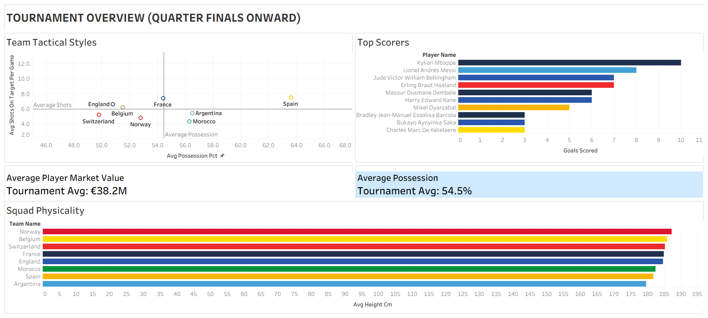

# ⚽ Tournament Tactical & Performance Analytics Dashboard

An executive analytics dashboard built in Tableau evaluating team tactical profiles, squad physicality, and player performance metrics for quarter-finalists onward.

---

## 📌 Project Overview & Analytical Framing
This project connects squad resources, physical traits, tactical execution, and individual talent into a unified analytical view:
* **Economic Baseline:** Establishing squad quality through player valuation standards (€38.2M average).
* **Physical Profile:** Analyzing average squad height to understand structural advantages in set-pieces and aerial play.
* **Tactical Execution:** Evaluating possession control vs. direct shooting efficiency via quadrant scatter analysis.
* **Individual Impact:** Isolating top goal scorers converting tactical chances into tournament results.

---

## 🛠️ Tools Used
* **Data Visualization:** Tableau Desktop
* **Design & Layout:** Custom container structure, dynamic text marks, unified team color palettes
* **Data Prep & Analysis:** Excel / CSV

---

## 🚀 How to View
* **Local View:** Download the `Tournament_Overview.twbx` file from this repository and open it using Tableau Desktop or free Tableau Reader.
